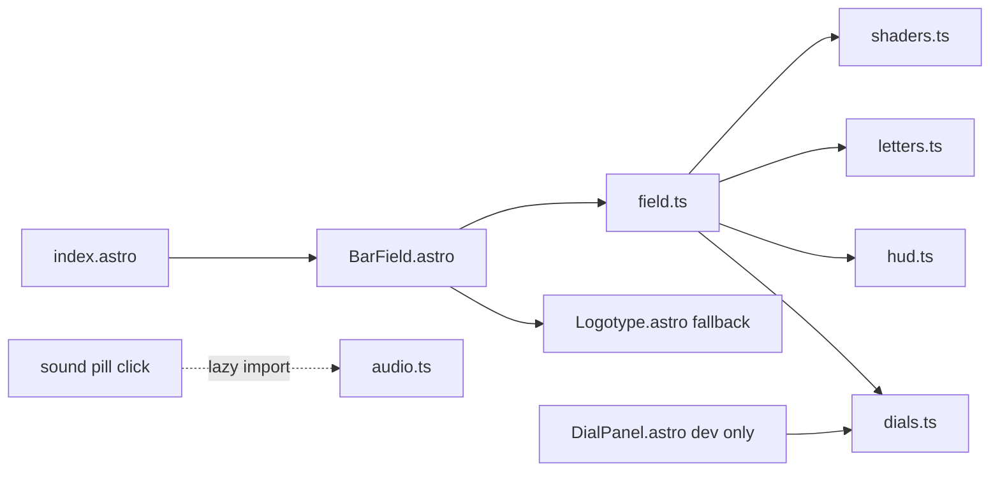

> **Date:** 2026-09-13
> **What prompted it:** Omar asked to flip the v6 sketch's sound on by default and to plan
> incorporating the vert-bars exploration as the site's main homepage — "tell me what is there now,
> what should we do to make sure everything is setup appropriately". The sound half turned out to be
> blocked by browser autoplay policy (an `AudioContext` cannot resume without genuine user
> activation), so on being shown the constraint he chose to keep the explicit opt-in pill and that
> part of the request was dropped. He also decided the bar field replaces the *whole* homepage, and
> that the other pages stay untouched for now since a restructure of them is coming separately.

# Bar field as the homepage

## Decisions locked

- The bar field **is** the whole homepage — wordmark, tagline, sound, redline. No cards, no nav.
- Other pages stay exactly as they are (light, `#ffffff`), and the homepage links to none of them, so nothing needs to reconcile. The homepage carries its own dark palette.
- **Sound stays opt-in via the pill.** The "on by default" part of the original request is dropped: browsers refuse to resume an `AudioContext` without genuine user activation. This is a win — it lets the ~740-line audio engine load lazily instead of on the critical path.

## What's there now

- [src/pages/index.astro](src/pages/index.astro) renders an `immersive` Base with an `sr-only` `<h1>Omar Jalalzada</h1>` + "work in progress." for crawlers, then `<Constellation cards={cards} />`.
- [src/components/constellation/Constellation.astro](src/components/constellation/Constellation.astro) is ~900 lines: animated SVG logotype, drag-and-scroll card field, pill nav, in-place detail overlay. It is used **only** by `index.astro`.
- In production `SOFT_PRESENCE` empties `cards`, flipping it to `soft` mode, so omar.build shows only the mark + tagline today. The card field is effectively dev-only, so this swap costs nothing in production.
- [src/components/constellation/Logotype.astro](src/components/constellation/Logotype.astro) uses `viewBox="403 624 1232 281"`, O at `x=450`, R ending at `x=1560` — the **same wordmark in the same coordinate system** as the shader's letters. It becomes the WebGPU fallback for free.
- No WebGPU anywhere in `src/` yet. `vgpu@0.4.1` is a devDependency, vendored as a 182KB bundle per explore folder.

## The load-bearing refactor

`bindDials()` reads `P` out of the DOM; `dragDial()` writes back into it. Extract a single source of truth:

- **`src/components/barfield/dials.ts`** — the dial spec as data (`{ id, group, label, min, max, step, value, fmt }`), the live `P` object, `setDial(id, v)` with clamping, and a change-subscription replacing `onDialChange`. Ported verbatim from the `value`/`min`/`max`/`step` attributes now in the markup (lines 212–396).
- `dragDial()` calls `setDial()` instead of touching the DOM.
- **`src/components/barfield/DialPanel.astro`** — the slider panel becomes an optional *view* over `dials.ts`, rendered `{import.meta.env.DEV && <DialPanel />}`, same pattern as [src/pages/design-system.astro](src/pages/design-system.astro) and the dev-only screenshot plugin. Keeps Copy dials / Reset working for iteration; ships nothing.
- `hudRight()` and `markOffsetCss()` collapse to their existing `panel-closed` branch when no panel exists.

## Module split

The 2,944-line sketch splits along boundaries it already has:

- `shaders.ts` — `FIELD_WGSL` / `BRIGHT_WGSL` / `BLUR_WGSL` / `COMPOSITE_WGSL` (lines 614–1030). Names keep `WGSL` in them so `node scripts/check-wgsl-literals.mjs` still validates them; verify its reported literal count is 4.
- `letters.ts` — `LETTERS`, `updateLetters`, accordion fit solve, `autoGain` (1231–1517).
- `hud.ts` — `brackets`, `drawConnectors`, `drawTagline`, `drawDialGauge`, `drawHud` (1518–2143). All of this ships except the fps readout.
- `audio.ts` — `GROOVES` + `createAudio` (2145–2882), **dynamically imported on first pill click**.
- `field.ts` — vgpu init, the 5-pass bloom chain, the frame loop, rave state machine.
- `BarField.astro` — stage markup (`#gl`, `#hud`, sound pill), scoped styles, boot script.

## Setting it up appropriately

- **Dependency**: move `vgpu` from `devDependencies` to `dependencies` in [package.json](package.json). It is `"type": "module"` with `"sideEffects": false`, so Vite tree-shakes and minifies it — expect well under the vendored 182KB. Delete no explore folders; `public/explore/vert-bars/v6/` stays as the archive, per the never-overwrite rule.
- **Palette without breaking the tokens rule**: the sketch's `#140c16` ground, `#f0d24a` HUD yellow and `#ff5a3c` redline become a scoped set (`--field-bg`, `--field-hud`, `--field-hot`) declared on the component, plus `color-scheme: dark` scoped to `body.immersive` so it cannot leak into the light pages. Hue/sat stay shader parameters.
- **Fallback**: `navigator.gpu` missing or `init()` throwing renders `<Logotype animate />` at the same coordinates instead of the current "This one needs WebGPU" explainer. A homepage must never show a browser-support notice.
- **Reduced motion**: map `prefers-reduced-motion: reduce` onto the existing `animate=false` path — settled field, no drift, no shimmer. Sound is already gated behind a click.
- **Touch**: real bug to fix. `pointerdown` sets `grab.idx = lastHit`, and `lastHit` is only ever set by `pointermove` — which on touch does not fire before the finger lands, so the first tap-drag on a phone does nothing. Hit-test at the pointer position inside `pointerdown` rather than trusting `lastHit`. Also set `touch-action: none` on the stage so a vertical drag changes BPM instead of scrolling.
- **Mobile cost**: 246 columns through a 5-pass bloom chain is a lot for a phone GPU. Scale `cols` and the bloom half-res targets by viewport, and cap device pixel ratio.
- **Badge**: `explore / vert-bars / v6 · z-space · fps` is wrong on a homepage. Drop it in production; keep fps in dev. The redline tell survives on the BPM gauge label, which is the better place for it anyway.
- **SEO**: keep the existing `sr-only` header. The tagline is already real DOM text. Leave `SOFT_PRESENCE_ENABLED` alone — it still governs the other routes and the sitemap; the homepage simply stops consulting it and drops its `getVisible()` calls.
- `Constellation.astro` becomes unused. **Leave the file in place** — a restructure of the other pages is coming and it shouldn't be pre-emptively deleted.

## Considered and rejected

Iframing `public/explore/vert-bars/v6/index.html` into the homepage would work today with no refactor, but ships 327KB unminified in a second document with no crawlable content and the dial panel visible. Wrong for a homepage.

## Verification

Screenshot API after each stage (`curl "http://localhost:4321/api/screenshot?view=/" -o /tmp/shot.png`) — it already launches Chrome with `--enable-unsafe-webgpu`. Check: mark renders and is centred without the panel; every dial default matches the committed v6 values; drag on each of O/M/A/R moves its own dial; the O can be held at 140 to trigger redline; production build contains no panel markup and no audio chunk until consent. Then `npm run build` and confirm the other pages are byte-for-byte unchanged.

Nothing gets pushed until you've seen it in the browser and said go.

## Open question for later, not now

Base.astro has no `og:image`. A homepage that *is* a visual should have one, and the screenshot plugin can generate it. Parking in [docs/ideas.md](docs/ideas.md) unless you want it in scope.
