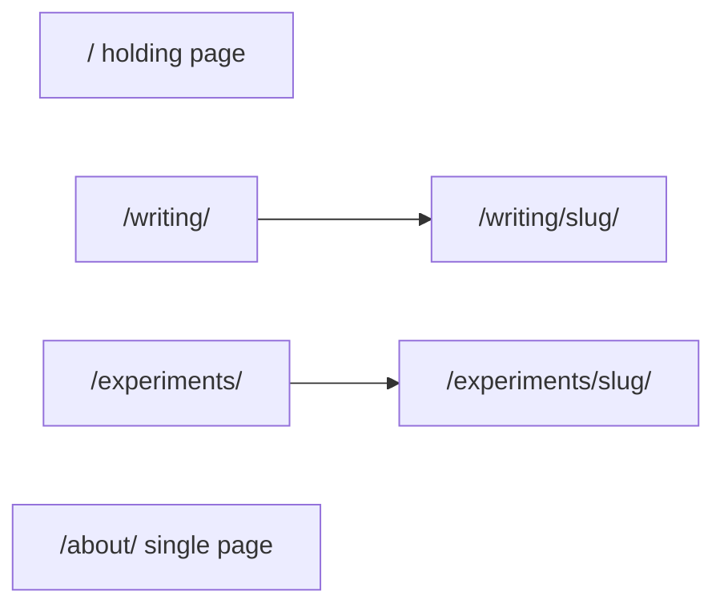

> **Date:** 2026-09-24
> **What prompted it:** Omar is abandoning the original idea of one big homepage canvas with cards
> laid out across it, and wants the site simplified to a homepage (empty for now) plus one page each
> for Writing, Experiments and About. He chose a single About page that absorbs the useful parts of
> the old `about` card collection, and to keep the Writing and Experiments listings exactly as they
> are. He then added that the site nav, which only appeared on subpages, should show on the homepage
> too — hidden in production while soft presence is on, since every nav target redirects home there.

# Simplify the site to four pages

## Target structure

- `/` stays the "work in progress" holding page, now with the site nav (see section 3).
- `/writing/` and `/experiments/` stay exactly as they are: React cards, the topic filter, motion. Their detail pages stay too.
- `/about/` becomes the only About page. The `about/[slug]` sub-pages go away.

## 1. One About page

Fold the useful content from the `about` collection into [src/pages/about.astro](src/pages/about.astro), which already has the intro, focus areas, the Work list and Contact:

- **Bio** from `src/content/about/bio.md`: the Afghan-American line (Kabul, Pakistan, California) merges into the opening paragraph.
- **Now** from `src/content/about/currently.md`: a short "Now" section, "Building the security product that doesn't make experts feel stupid," with its "Updated June 2026" date.
- **Résumé** from `work-history.md`: a read.cv link at the end of the Work section.
- **Contact** from `contact.md` is already on the page with the same email, so nothing to add.

`influences.md` and `travel.md` have no content yet beyond a one-line placeholder, so they are not added as empty sections. Both get parked in [docs/ideas.md](docs/ideas.md) as future About sections.

Then remove the collection and its routes:

- Delete `src/content/about/` (6 draft entries) and [src/pages/about/[slug].astro](src/pages/about/[slug].astro).
- Remove the `about` collection from [src/content.config.ts](src/content.config.ts) and `'about'` from `CollectionName` in [src/lib/content.ts](src/lib/content.ts).
- The `work` collection stays because it still feeds the Work list.

## 2. Remove the canvas leftovers

Grep confirms none of these are imported anywhere:

- `src/components/constellation/Constellation.astro` (906 lines) and `Logotype.astro`, which only Constellation used. The bar field lab already inlines its own copy of the logotype SVG.
- `src/components/Card.astro` and `src/components/CardGrid.astro`, an unused Astro duplicate of the React cards in `src/components/ui/`.

In [src/layouts/Base.astro](src/layouts/Base.astro), rename the nav class `cnst-nav` to `site-nav` and fix the comments that describe it as copied from Constellation, including the `.calm-bg` "matches the home canvas" note.

Left alone on purpose: [src/pages/design-system.astro](src/pages/design-system.astro), and the "Constellation" naming in `tokens.css`, which names the visual identity rather than the removed component.

## 3. Nav on the homepage

The homepage hides the nav because it's the only page using Base's `immersive` mode, which renders the slot with no chrome. So:

- Drop `immersive` from [src/pages/index.astro](src/pages/index.astro). With no users left, delete the `immersive` prop and its branch from `Base.astro` entirely, so every page goes through the same layout.
- Keep "work in progress" centered in the viewport rather than in `main`'s padded box: `.wip` becomes `position: fixed; inset: 0; display: grid; place-items: center`. The nav sits above it at `z-index: 80`, so it stays clickable.
- Hide the nav while soft presence is live in production. In `Base.astro`, render the `<nav>` only when `!SOFT_PRESENCE` (imported from `src/lib/soft-presence.ts`). `SOFT_PRESENCE` is already false in dev, so the nav shows there on every page, and it appears in production automatically once `SOFT_PRESENCE_ENABLED` is flipped off. This matters because all three nav targets currently redirect to `/` in production.

## 4. Docs

- [CLAUDE.md](CLAUDE.md): the note saying `Logotype.astro` stays in `src/` because Constellation uses it is now false. Update it, add a short site-structure line naming the four pages, and note that the nav is hidden in production while soft presence is on.
- Archive this plan to `docs/plans/2026-09-24-simplify-site-pages.md` and add an index row in [docs/plans/README.md](docs/plans/README.md), per the plan-archive rule.

## Branch and existing work

This worktree is on `baseline` (same commit as `main`) with two unrelated uncommitted edits: the Farsh version switcher and `skills-lock.json`. Do this on a fresh branch from `main` and leave those files untouched. No PR unless you ask.

Separately, [PR #23](https://github.com/omar-jalalzada/oooomar-v5/pull/23), which removes the five placeholder experiments, is still open, so this branch still shows ten experiments until that's merged.

## Verification

- `npm run build` passes.
- Grep finds no remaining references to `Constellation`, `Logotype`, `components/Card.astro`, `getVisible('about')`, `cnst-nav` or `immersive`.
- Dev screenshots: `/` shows centered "work in progress" with the nav; `/about/` shows the merged content; `/writing/` and `/experiments/` look unchanged; `/about/bio/` returns 404.
- Production build: `dist/index.html` contains no `<nav>` while soft presence is on.
- Then share the local URL for your review before any commit.
