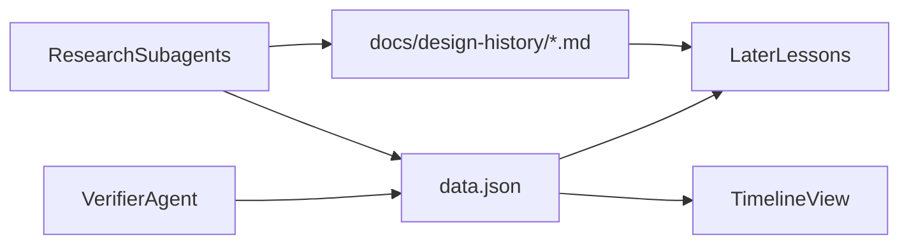

# Design history timeline

**Date:** 2026-10-03  
**Prompt:** Omar wants a new educational experiment on the history of graphic design (movements, key figures, their principles) for senior designers remixing it in the AI era. Step one is deep research into a wiki and a unified, scroll-driven vertical timeline.

## Shape of the work

- **Phase 1: research.** Parallel subagents write a wiki (prose, for the course material later) plus structured timeline data (for the view). One verifier pass cross-checks the dates.
- **Phase 2: the timeline.** A new self-contained experiment at `public/prototypes/design-history/`. It follows the Atlas pattern of a static `index.html` that loads its own `data.json`, with no build step and no external deps.
- **Later phases, out of scope here:** one movement or one figure at a time, as motion lessons that draw each principle. The data ids defined now are the hooks those lessons will hang off.



## Phase 1: research (about 9 subagents in parallel)

Each agent covers one slice. It writes `docs/design-history/<slice>.md` (prose: context, principles with concrete examples, key works, sourced quotes) and a matching JSON fragment that follows the schema below. Each agent also lists its sources: primary sources, Meggs' *History of Graphic Design*, museum collections such as MoMA, Cooper Hewitt and the Design Museum, and the AIGA medalist pages.

1. 1850–1914, ornament to reform: Victorian print, Arts & Crafts (Morris, Kelmscott), Art Nouveau (Mucha, Toulouse-Lautrec, Chéret), the Glasgow School, the Vienna Secession and Wiener Werkstätte, Plakatstil (Bernhard, Hohlwein), Behrens at AEG
2. 1905–1939, the avant-garde: Futurism, Dada, De Stijl, Suprematism, Constructivism (Rodchenko, Lissitzky, the Stenbergs), the Bauhaus (Moholy-Nagy, Bayer), New Typography (Tschichold), Art Deco (Cassandre), Isotype (Neurath, Arntz)
3. 1945–1975, Swiss and International style: Müller-Brockmann, Hofmann, Ruder, Gerstner, Frutiger, Max Bill and the Ulm school (Aicher), Rams and Braun, Crouwel and Total Design
4. American modernism and corporate identity: Brodovitch, Lustig, Rand, Bass, Vignelli, Chermayeff & Geismar, Glaser and Push Pin, Lubalin, Pentagram, Paula Scher
5. Postmodern to digital print: psychedelia, punk, Swiss Punk and New Wave (Weingart, Greiman), Memphis, Cranbrook, Emigre (Licko, VanderLans), Brody, Carson, Sagmeister, Experimental Jetset
6. The screen era: Xerox PARC, Susan Kare, the Apple Human Interface Guidelines, skeuomorphism, Metro, flat design and iOS 7, Material Design, neubrutalism, Liquid Glass (2025), generative and AI-native design
7. Japan and East Asia: Kamekura, Tanaka, Yokoo, Nagai, Hara, Sato; Chinese and Korean modernism
8. Eastern Europe and the Middle East: the Polish poster school (Tomaszewski, Lenica, Cieślewicz), the Czech avant-garde, Iranian graphic design (Momayez, Shiva, Ali Akbar Sadeghi), Arabic typography and modernism
9. Latin America: Brazilian concretism (Wollner, Magalhães), Cuban posters (OSPAAAL), Mexico 68 (Wyman), Argentina

A **verifier agent** then merges the fragments into `data.json` and checks it:

- dates against at least two sources
- that every figure's `movements` resolve
- that influence edges point both ways sensibly

It also lists the gaps and the disputed dates in `docs/design-history/README.md`.

**Turning points** (technology and context) are part of the dataset: chromolithography, halftone, offset, phototypesetting, the Macintosh (1984), PostScript (1985), the web (1991), the iPhone (2007), generative AI (2022).

### Data schema (`public/prototypes/design-history/data.json`)

```js
{
  lineages: [{ id, name }],       // about 6 families, the timeline's colour code
  movements: [{ id, name, start, end, peak?, region, lineage,
                influences: [movementId], principles: [string], keyWorks: [{ title, year, figure }] }],
  figures:   [{ id, name, born, died?, activeFrom, activeTo, signatureYear,
                region, movements: [movementId], principles: [string], keyWorks: [...] }],
  events:    [{ year, label, kind: "technology" | "context" }]
}
```

The ids match the wiki file headings, so the later lessons can link straight into both.

**Images:** the timeline needs none. The later lessons redraw each principle as motion rather than reproducing copyrighted posters, and that is the more educational route anyway.

## Phase 2: the timeline view

**Layout (Swiss grid):**

- The year axis runs down the left, with hairline decade ticks and a large tabular-figure year that tracks the scroll position.
- Movements are vertical bars running from `start` to `end`, packed into columns by interval overlap and grouped by region. The region labels are typographic, not coloured.
- Figures are circles placed at their `signatureYear`. A hairline stem behind each circle spans the figure's working years, and the circle sits beside the movement it belongs to.
- Turning points are full-width hairlines with small labels, so you can see what made each style possible.

**Colour:** black ink on white, and every rule a hairline (the `--hud-hair` and `hair()` convention). Colour is reserved for the about six lineages, each a single flat colour. One red marks the "now" line where the scroll position meets the axis. Nothing else gets colour.

**Type:** a vendored grotesk woff2 in the folder, the same way `naughty-narwal` and `card-tricks` vendor theirs. The page has a strict typographic scale: the year display, movement names and figure names.

**Motion (purposeful, fluid):**

- As you scroll, a bar grows downward from its start the moment the "now" line reaches it, and a figure's circle pops in with a spring when its year arrives. Influence curves draw in from parent to child movement, so you watch lineages form.
- Hovering or tapping a movement dims everything unrelated and shows its figures, influences and three principles in a side panel. Tapping a figure does the same from the figure's side.
- A minimap rail on the right shows all 175 years. You can drag it to scrub, and it marks the region you are in.
- Scrolling is native, with a requestAnimationFrame-smoothed year readout. `prefers-reduced-motion` drops the springs and draws the timeline static.
- Touch follows the existing conventions: hit-test inside `pointerdown`.

**Rendering:** DOM and SVG rather than canvas, so the text is crisp and selectable and the panel is accessible. About 60 movements and 200 figures is well within budget.

## Repo conventions to follow

- Work on a feature branch, e.g. `design-history`.
- Archive this plan to `docs/plans/2026-10-03-design-history-timeline.md` and add its line to the README index before starting.
- Register the experiment with `src/content/experiments/design-history.md` (`status: draft`, `prototype: design-history`). The schema requires a `card.look`, so add a new look to each preset in `src/lib/experiment-card/` (the Card Tricks rule: one mark, one pin, one accent). Do this last.
- Verify with the screenshot API, `view=/prototypes/design-history/index.html` and `full=1`, at both desktop and phone widths. Start `npm run dev` for Omar's live review before anything is committed.